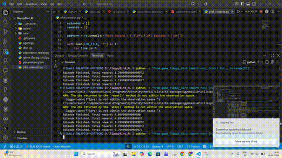
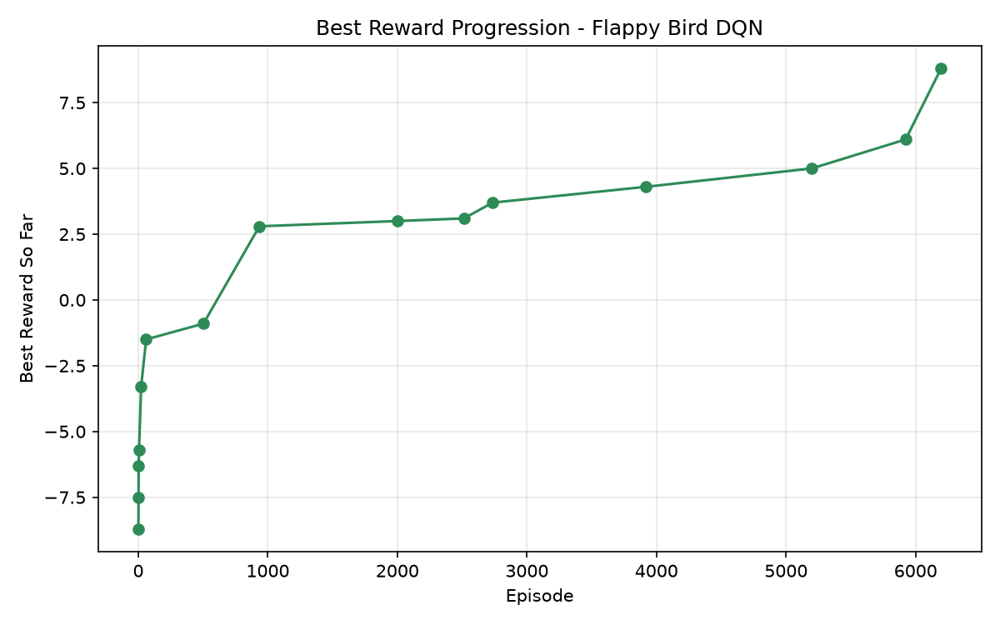

<div align="center">

# 🐦 Flappy Bird DQN

### A Deep Q-Network agent that learns to fly — built from scratch in PyTorch

[](https://www.python.org/)
[](https://pytorch.org/)
[](https://gymnasium.farama.org/)
[](LICENSE)



</div>

<br>

## ✨ What is this?

This project trains an AI agent to play Flappy Bird using **Deep Q-Learning (DQN)** — no hand-coded rules, no scripted behavior. The agent starts out flying completely blind and, through trial, error, and reward signals alone, learns to navigate pipes on its own.

Built entirely from scratch, including:

| Component | What it does |
|---|---|
| 🧠 `dqn.py` | Q-network — a simple feed-forward net that estimates action values |
| 💾 `experience_replay.py` | Replay buffer so the agent learns from past experience, not just the current frame |
| 🎯 `agent.py` | Training loop — epsilon-greedy exploration, target network sync, optimization |
| ⚙️ `parameters.yaml` | All hyperparameters in one place, no digging through code to tune |

<br>

## 📈 Training Results

<div align="center">

</div>

The agent's best reward climbed from **-8.7** (dying almost instantly — no better than random) to **8.8** by episode ~6,200, then plateaued for the rest of the 10,000-episode run.

> **🔍 Honest take:** Flappy Bird is a brutal environment for vanilla DQN — sparse rewards make it easy to get stuck in a local optimum, which is exactly what happened here. The agent has clearly learned *something* (surviving meaningfully longer than random), but hasn't cracked reliable pipe-threading yet. Improvement ideas are below 👇

<br>

## 🚀 Quick Start

```bash
# 1. Install dependencies
pip install -r requirements.txt

# 2. Train the agent
python agent.py flappybirdv0 --train

# 3. Watch it play
python game_flappy_bird.py
```

<br>

## 🎛️ Hyperparameters

<div align="center">

| Parameter | Value |
|:---|:---:|
| Learning rate (α) | `0.001` |
| Discount factor (γ) | `0.99` |
| Epsilon (start → min) | `1.0` → `0.05` |
| Epsilon decay | `0.9995` |
| Replay memory size | `100,000` |
| Mini-batch size | `32` |
| Target network sync | every `10` steps |
| Episode reward cap | `1,000` |

</div>

All configurable in [`parameters.yaml`](parameters.yaml) — no code changes needed to experiment.

<br>

## 📂 Project Structure

```
.
├── agent.py                # Training & testing loop
├── dqn.py                  # Q-network architecture
├── experience_replay.py    # Replay memory buffer
├── game_flappy_bird.py     # Load trained model & watch it play
├── plot_rewards.py         # Generates the reward curve chart
├── parameters.yaml         # Hyperparameter configs
├── requirements.txt
├── runs/                   # Saved models (.pt) + training logs
└── assets/                 # README media
```

<br>

## 🔭 Next Steps

- [ ] Train longer / tune epsilon decay to break past the current plateau
- [ ] Try Double DQN or Dueling DQN for more stable learning
- [ ] Add reward shaping for a denser learning signal
- [ ] Move training to GPU for faster hyperparameter iteration

<br>

<div align="center">

**Built with** Python · PyTorch · Gymnasium

</div>